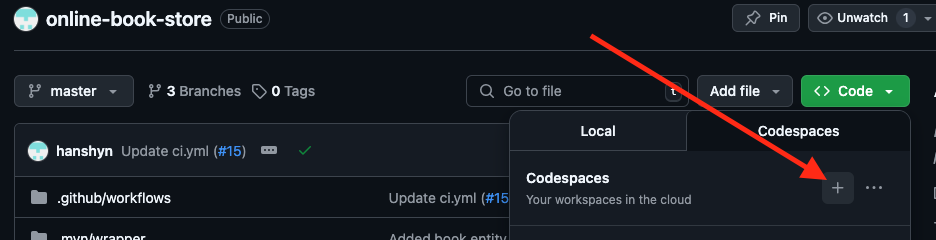

# 📚 **Book Store Project**

## 📝 Description 
The "Online Book Store" web application is developed using Spring Boot to create RESTful APIs that facilitate 
interaction between users (USER) and administrators (ADMIN) with the bookstore's database. 
The project demonstrates the application of modern authentication technologies and data management, 
simulating the core functionalities of e-commerce
in the book industry.

## Project Overview
The Book Store API offers the following functionalities:
* Roles: Defines two user roles: ADMIN and USER.
* ADMIN Book Management: Includes adding, removing, editing book information, and categorizing books.
* USER Shopping Cart: Allows users to select multiple books with different quantities before ordering.
* ADMIN Order Management: Enables saving and status tracking of orders.

## 📋 Technology Stack

### Core
|         |                Description                |
|:-------:|:-----------------------------------------:|
| Java 17 | Core programming language of the backend  | 
|  Maven  |     Project management and build tool     |

### Spring
|                        |                       Description                        |
|:----------------------:|:--------------------------------------------------------:|
|   Spring Boot 3.1.5    |     Architecture framework for building applications     |
|    Spring Data JPA     | Simplifies database access operations using JPA and ORM  |
|  Spring Boot Security  |  Provides authentication and authorization capabilities  |
| Spring Boot Validation |    Ready-to-use collection of data constraints/checks    |

### Database & Migrations
|              |                   Description                   |
|:------------:|:-----------------------------------------------:|
| MySQL 8.0.33 |           Database management system            |
|  Liquibase   | 	Tool for database creation and version control |

### Testing 
|                |             Description             |
|:--------------:|:-----------------------------------:|
|    JUnit 5     |       Unit testing framework        |
| Testcontainers | Containerized testing environments  |
|    Mockito     | Mocking frameworks for unit testing |

### Additions tools & libraries
|                |                Description                |
|:--------------:|:-----------------------------------------:|
|     Lombok     |   Library for Java code simplification    |
|   MapStruct    |       Tool for simple data mapping        |
|      JWT       |          Authorization standard           |
|     Docker     |           Containerization tool           |
| Docker Compose | Orchestrates multi-container applications |
|    Swagger     |     Tools to create API documentation     |


## 📌 Endpoints

Some endpoints require a [role] for access, use JWT token (Bearer) or Basic authentication.

### UserController: Handles registration and login requests.
* POST: /api/auth/registration - register new user.
* POST: /api/auth/login - login user and receive JWT token.

### BookController: Handles requests for book operations (Authorization is required).
* GET: /api/books - Retrieve all books with optional pagination.
* GET: /api/books/{id} - Search a specific book by ID.
* GET: /api/search - Fiter books by symbols contained in title or author name with optional pagination.
* POST: /api/books - Create a new book. [Admin]
* PUT: /api/books/{id} - Update book data. [Admin]
* DELETE: /api/books/{id} - Soft delete a book. [Admin]


### CategoryController: Handles requests for category operations and getting all books by category(Authorization is required).

* GET: /api/categories - Retrieve all categories.
* GET: /api/categories/{id} - Retrieve a specific category by its ID.
* GET: /api/categories/{id}/books - Retrieve all books of category by a category ID.
* POST: /api/categories - Create new category. [Admin]
* PUT: /api/categories/{id} - Update category data. [Admin]
* DELETE: /api/categories/{id} - Soft delete category. [Admin]

### ShoppingCartController: Handles requests for shopping cart operations (Authorization is required).
* GET: /api/cart - Retrieve all items from a shopping cart.
* POST: /api/cart - Add an item to a shopping cart.
* PUT: /api/cart/cart-items/{cartItemId} - Update quantity of a specific item in shopping cart.
* DELETE: /api/cart/cart-items/{cartItemId} - Delete items from the shopping cart.

### OrderController: Handles requests for order operations.
* GET: /api/orders - Retrieve all user orders.
* GET: /api/orders/{order-id}/items - Retrieve all items from a specific order.
* GET: /api/orders/{order-id}/items/{item-id} - Retrieve a specific item from a specific order.
* POST: /api/orders - Create an order.
* PATCH: /api/orders/{id} - Updating an order status. [Admin] Allowed order status values are: COMPLETED, DELIVERED, PENDING


## 💻 How to run the project locally
### 1. Download [Java](https://www.oracle.com/java/technologies/javase/jdk17-archive-downloads.html) and [Docker Desktop](https://www.docker.com/).
### 2. Clone the project:
````bash
git clone https://github.com/hanshyn/online-book-store.git
````
### 3. Add a .env file to the root folder of the cloned project and add your configuration.

Example config:
```
MYSQLDB_USER=root
MYSQLDB_USER_PASSWORD=password
MYSQLDB_USER_DATABASE=db_book_store
MYSQLDB_USER_LOCAL_PORT=3308
MYSQLDB_USER_DOCKER_PORT=3306

SPRING_LOCAL_PORT=8088
SPRING_DOCKER_PORT=8080
DEBUG_PORT=5005
```
### 4. Build the project:
```bash
mvn clean install
```

###  5. Build the Docker images and start the containers:
````bash
docker-compose up --build
````

## 🌐 How to run the project in Codespaces
### 1. Create a Codespaces on master: 


### 2. Checking and Setting up Java in Codespaces:
* verify if Java is installed in your Codespace:
```bash
java -version
```
> 💁
> If the installed version is below 17, or if Java is not installed at all, you will need to install it
> ```bash 
> sudo apt update
> sudo apt install openjdk-17-jdk 
> ```
> Then, check your JAVA_HOME environment variable:
>  ```bash 
> echo $JAVA_HOME
> ```
> If the path is incorrect (e.g., pointing to an older version), set the correct one. For example, if using OpenJDK 17:
>  ```bash 
> export JAVA_HOME=/usr/lib/jvm/java-17-openjdk-amd64
> export PATH=$JAVA_HOME/bin:$PATH
> ```

### 3. Add a .env file to the root folder and add your configuration.

Example config:
```
MYSQLDB_USER=root
MYSQLDB_USER_PASSWORD=password
MYSQLDB_USER_DATABASE=db_book_store
MYSQLDB_USER_LOCAL_PORT=3308
MYSQLDB_USER_DOCKER_PORT=3306

SPRING_LOCAL_PORT=8088
SPRING_DOCKER_PORT=8080
DEBUG_PORT=5005
```
### 4. Build the project:
```bash
mvn clean install
```

### 5. Start the project on Cpdespaces:
```bash
docker-compose up
```
### 6. To access the Swagger UI for the application running in Codespaces, follow these steps:

* Find the application URL: In your Codespaces environment, look for the "PORTS" tab (as shown in the screenshot you provided). Find the forwarded address for the port your application is running on (commonly 8080 or 8081, check your application's configuration if unsure). This address is the base URL for your application.
* Copy the URL: Copy the forwarded address displayed next to the relevant port.
* Open in browser: Open a new tab in your web browser.
* Access Swagger UI: Paste the copied URL into the address bar.
* Append the Swagger path: To the end of the URL, add the path `/swagger-ui/index.html.` The full address should look something like `https://your-codespace-url.github.dev/swagger-ui/index.html`
* Go: Press Enter to navigate to the Swagger UI page. From there, you can explore and test the API endpoints.